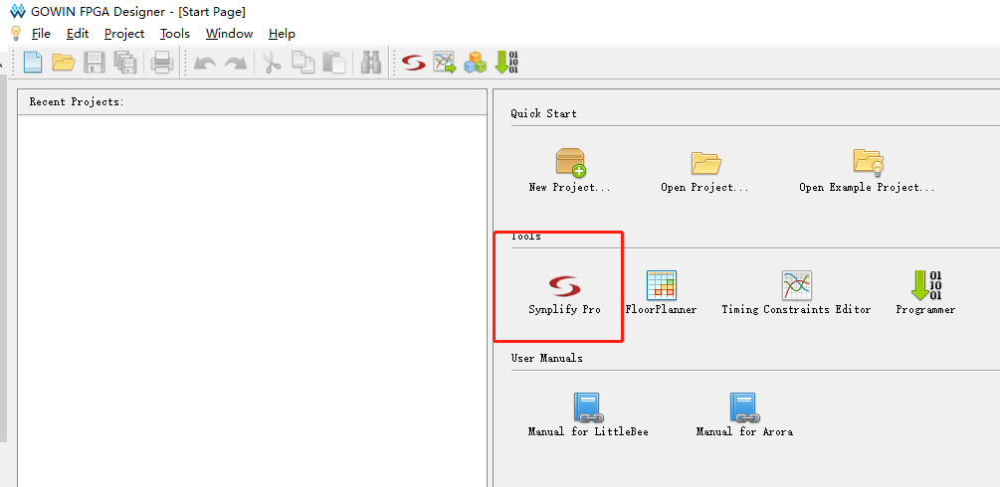

# 下载

进入官网 http://www.gowinsemi.com.cn/faq.aspx ，可以看到如下图的软件列表，选择适合电脑的系统的版本进行下载


# 安装

**Windows** 用户：

双击下载好的 exe 安装文件，选择安装语言、安装位置，鼠标点击下一步就可以完成安装了

完成安装时提示安装的驱动请务必安装


勾选安装驱动后点击完成后，就会进行驱动的安装

**Linux** 用户：

TODO

# license

高云云源软件需要 license 才能使用，目前软件的 license 是免费提供的，可以在[官网进行申请](http://www.gowinsemi.com.cn/faq_view.aspx)

不过在官网申请的方式比较麻烦，为了方便开发，可以通过 sipeed 的 licence 服务器使用高云软件

现目前有两种方式进行 license

**第一种：使用单机版 licence(需要修改mac)**

这种方式需要通过注册表修改网卡的 MAC

按下 `ctrl+r` ，在弹出窗口中输入 `regedit` 打开注册表

先在注册表下找到这个路径 `HKEY_LOCAL_MACHINE\SYSTEM\CurrentControlSet\Control\Class\{4d36e972-e325-11ce-bfc1-08002be10318}`

在这个路径下，有很多子路径，从 0000 开始，单击可以查看详情


看到 `DriverDesc` 这里写着这个网络适配器的名字

在 win10 `网络和 Intel` 设置中，有个 `更改适配器` 选项，打开后就可以看到自己本机上的网络适配器，刚刚点击的就是其中一个适配器


回到注册表中，我们需要像图 3-1 中红框部分一样，添加 `NetworkAddress` ，并把值修改为 `94C691A91EB6`

填加项可以在空白处 `右键 -> 新建 -> 字符串` ，如图


最后在系统命令行中输入 `ipconfig /all` ，在命令输出内容中可以看到修改是否生效


这里需要注意的是， win10 较新的版本中，似乎无法通过修改注册表的方式修改物理网卡，可能需要添加虚拟网卡才能进行修改，这里修改的就是 vmware 的虚拟网卡

这里需要下载两个离线 licence ，[gowin](../../assets/files/gowin.lic) 和 [synplifypro](../../assets/files/gowin_Synplifypro.lic)

在打开高云 IDE 的时候，在弹出的 licence 管理中，选择自己本地的 gowin.lic 的路径，即可


然后需要添加 synplifypro 的 licence 的路径到系统变量，下面只简单的介绍一种添加方法，在 `第二种：使用 sipeed 的 licence 服务器联网激活` 中，有更详细的介绍

**Windows** 用户在键盘上按 win+r 键，在弹出的运行窗口输入 `cmd`，点击确定后会弹出黑色命令行窗口，在里面输入下面命令，`path_to_the_file` 是你 `gowin_Synplifypro.lic` 的路径

```
setx LM_LICENSE_FILE path_to_the_file
```

**第二种：使用 sipeed 的 licence 服务器联网激活**

这种方式配置起来简单，不过没有网络的情况下无法使用软件

下载好软件打开后，软件会提示需要 licence，在弹出框中填入服务器地址 `45.33.107.56` 即可，IDE端口：10559


synopsys 高级功能的激活需要在系统中添加环境变量 `LM_LICENSE_FILE=27020@45.33.107.56`

**Windows** 用户在键盘上按 win+r 键，在弹出的运行窗口输入 `cmd`，点击确定后会弹出黑色命令行窗口，在里面输入下面命令

```
setx LM_LICENSE_FILE 27020@45.33.107.56
```

Windows 除了命令行的方式添加，也可以通过 右键电脑->属性->环境变量 ，然后如下图进行添加


**Linux** 用户需要在 `~/.bashrc` 中添加

```
export LM_LICENSE_FILE 27020@45.33.107.56
```

进入 IDE 后，点击 Tools 中的 `Synplify Pro`



随后会弹出界面如下图，这时需要等待一小会，等 licence 初始化完毕就可以使用


# 使用方法

参考官方文档[Gowin云源软件用户指南](http://cdn.gowinsemi.com.cn/SUG100-1.8_Gowin%E4%BA%91%E6%BA%90%E8%BD%AF%E4%BB%B6%E7%94%A8%E6%88%B7%E6%8C%87%E5%8D%97.pdf)，第5章 云源软件使用

# 参考文档

+ [高云软件简介和安装](http://cdn.gowinsemi.com.cn/%E9%AB%98%E4%BA%91%E8%BD%AF%E4%BB%B6%E7%AE%80%E4%BB%8B%E5%92%8C%E5%AE%89%E8%A3%85.pdf)

